# 🔄 WanderMind Travel Service - BPMN Diagrams

## Business Process Model and Notation (BPMN)

This document contains BPMN diagrams for key business processes in the WanderMind Travel Service.

## 1. User Registration Process

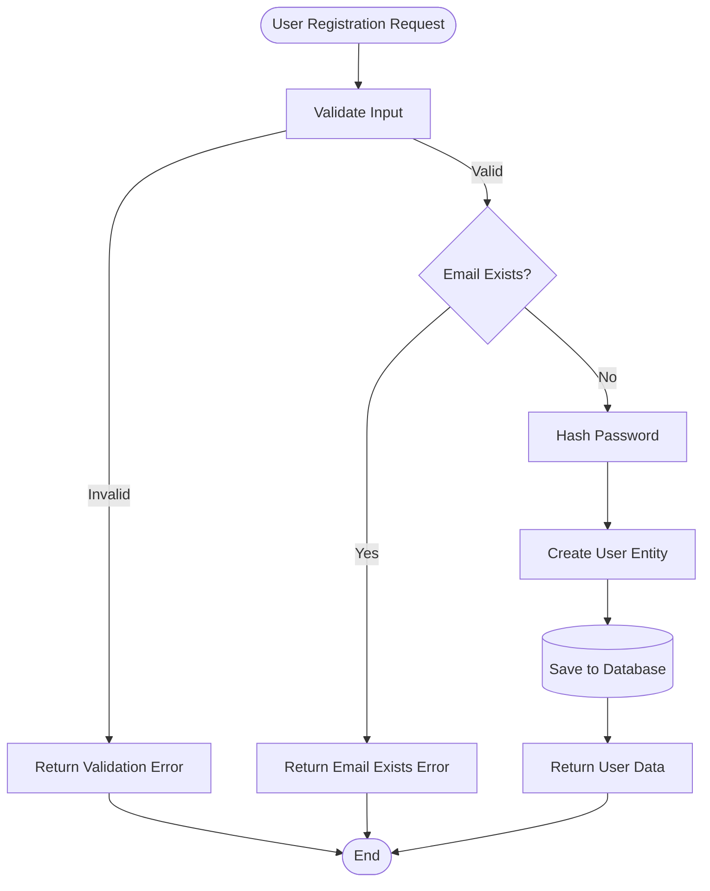

## 2. User Login Process

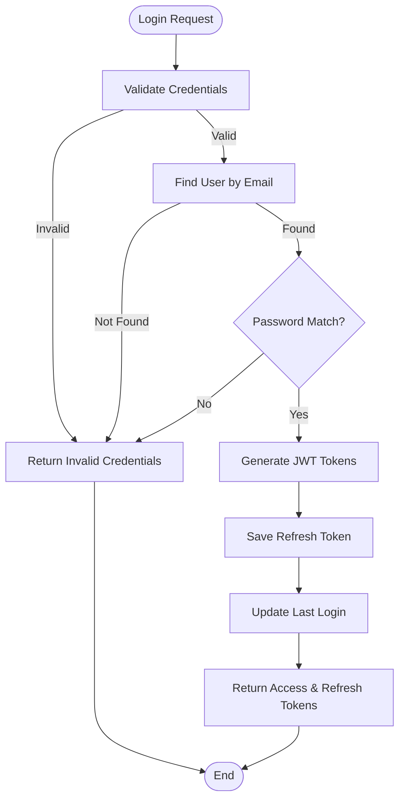

## 3. Plan Creation Process

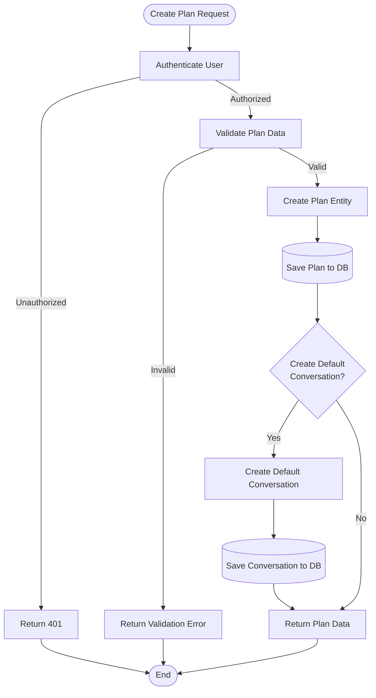

## 4. Job Creation and Processing Process

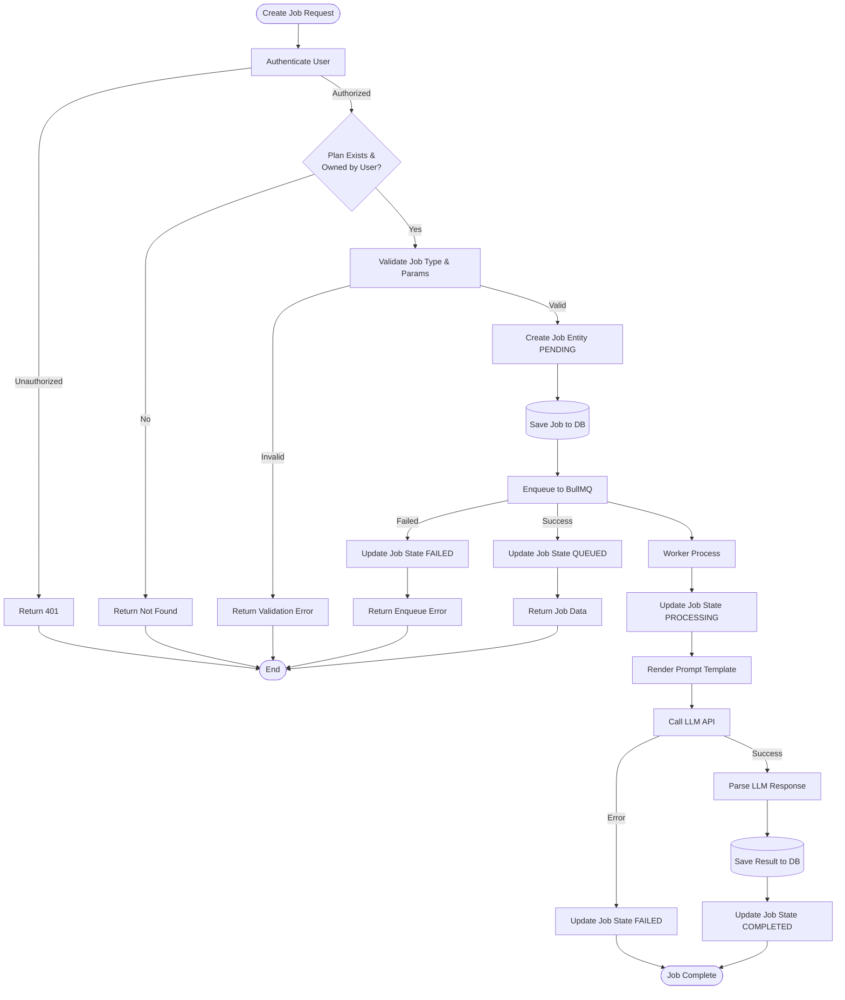

## 5. Chat Message Process

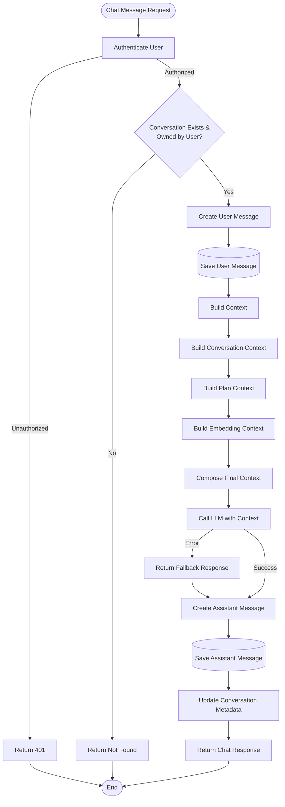

## 6. Embedding Creation Process

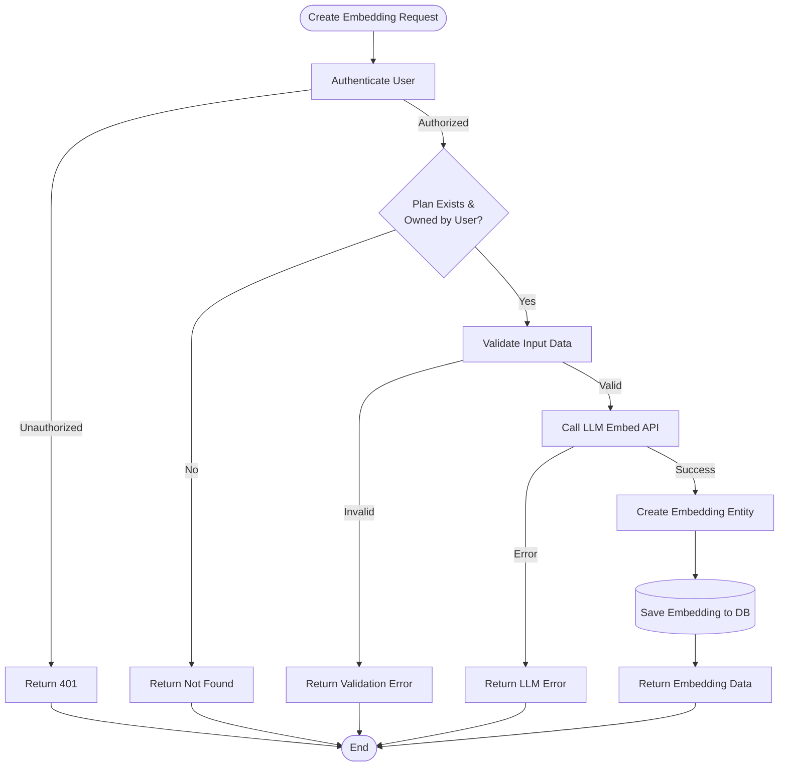

## 7. Semantic Search Process

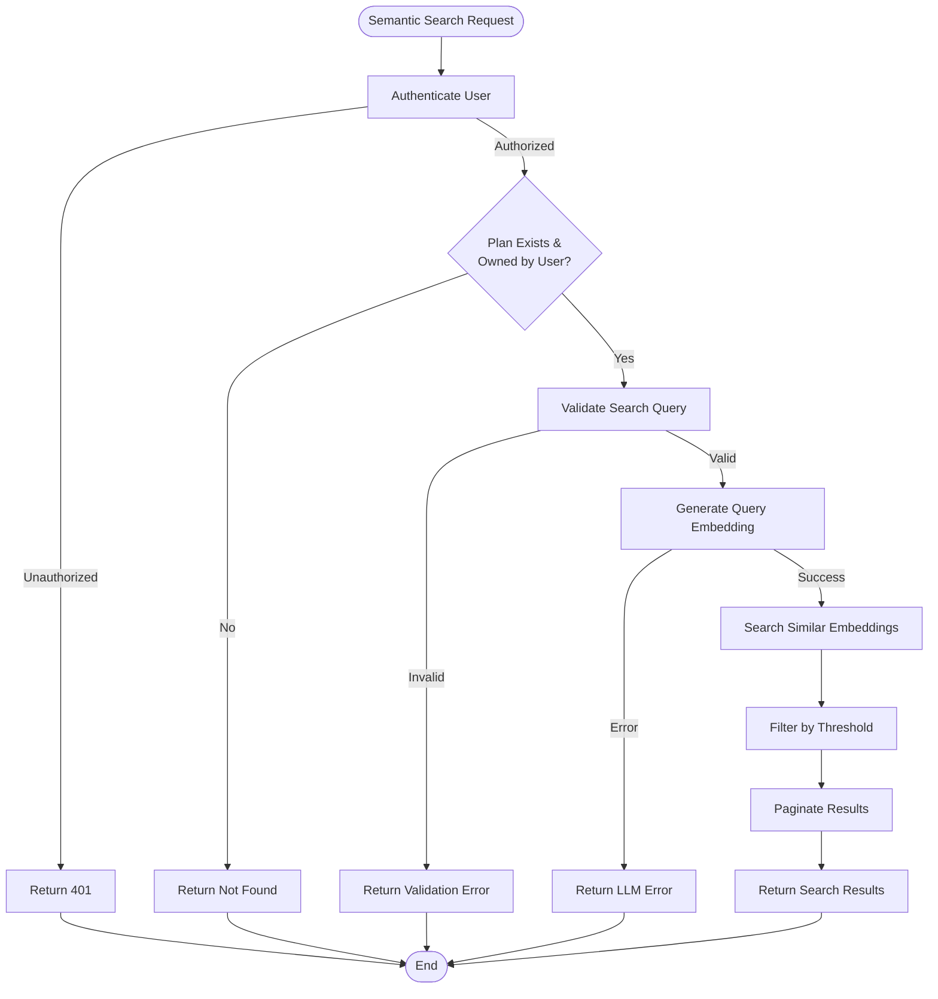

## 8. Memory Compression Process

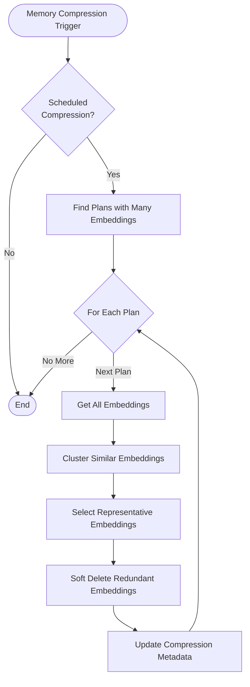

## 9. Context Building Process

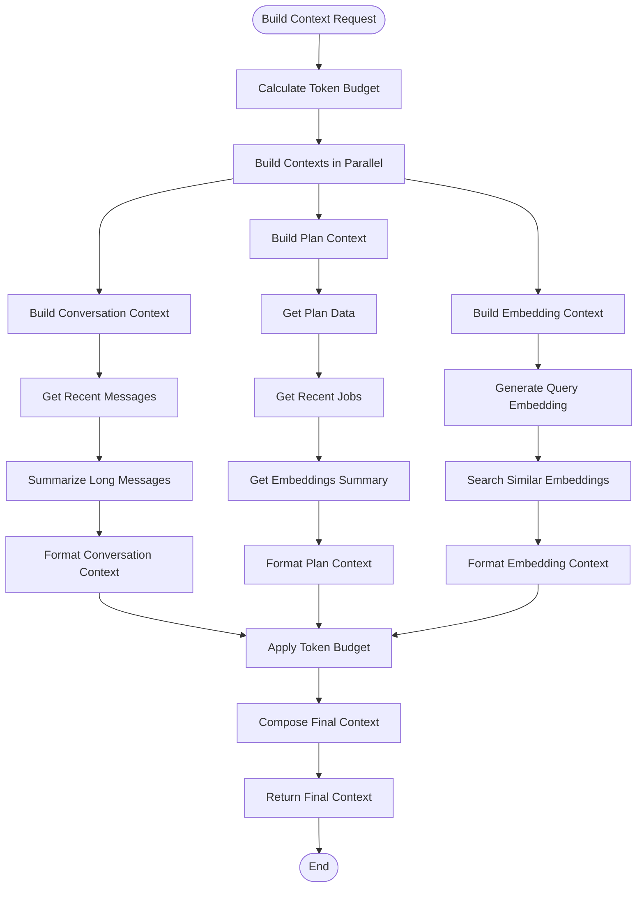

## 10. Token Refresh Process

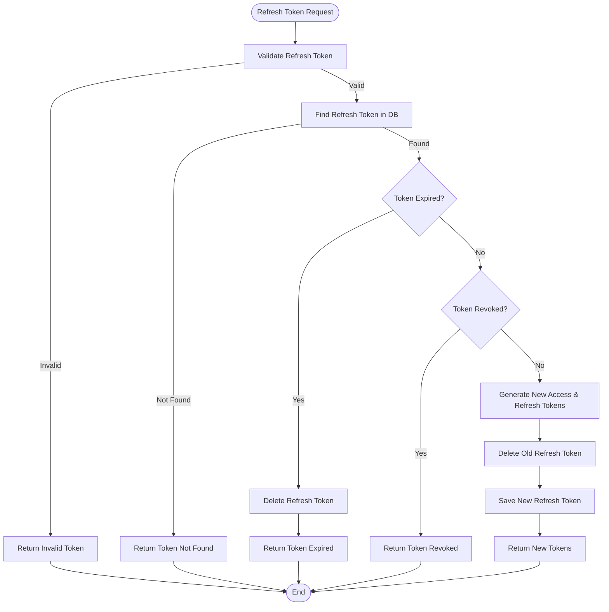

## 11. Error Handling Process

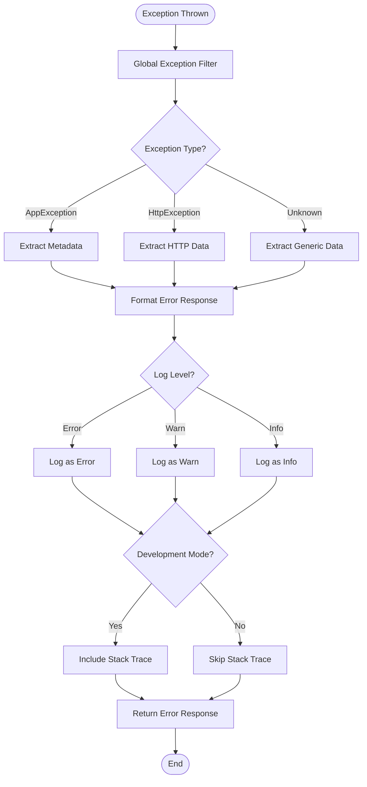

## 12. Rate Limiting Process

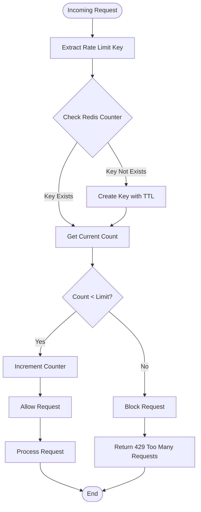

## Process Characteristics

### Synchronous Processes

- User Registration
- User Login
- Plan Creation
- Chat Message
- Embedding Creation
- Semantic Search
- Token Refresh

### Asynchronous Processes

- Job Processing (via BullMQ)
- Memory Compression (scheduled)

### Parallel Processing

- Context Building (conversation, plan, embedding contexts built in parallel)

### Error Handling

- All processes include error handling
- Global exception filter catches unhandled errors
- Structured error responses

### Validation

- Input validation at controller level
- Business rule validation at service level
- Database constraints at entity level
