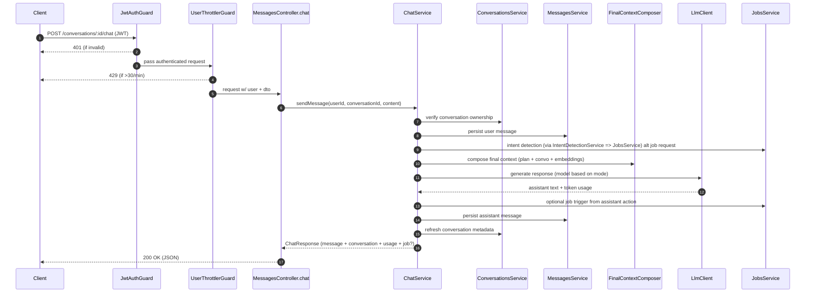

# 💬 Chat Endpoint Deep Dive (`MessagesController.chat`)

This document explains the complete flow triggered by `POST /conversations/:id/chat` in `messages.controller.ts` lines 55‑69. It covers guards, validation, downstream orchestration inside `ChatService.sendMessage`, and the primary debugging hooks.

---

## 1. Endpoint Overview

| Concern       | Details                                                                                            |
| ------------- | -------------------------------------------------------------------------------------------------- |
| Route         | `POST /conversations/:id/chat`                                                                     |
| Controller    | `MessagesController.chat`                                                                          |
| AuthN         | `JwtAuthGuard` (request must carry a valid bearer token)                                           |
| Rate limiting | `UserThrottlerGuard` + `@Throttle({ limit: 30, ttl: 60_000 })` → 30 chat calls per user per minute |
| DTO           | `ChatMessageDto` (`content` is required string, max 10 000 chars)                                  |
| Params        | `id` is conversation UUID v4 enforced by `ParseUUIDPipe`                                           |
| Service       | Delegates to `ChatService.sendMessage(user.id, conversationId, chatMessageDto.content)`            |
| Response      | `ChatResponse` (assistant message + conversation metadata ± usage ± job info)                      |

---

## 2. Execution Flow (Controller → Service)

1. **Authentication & Guard stack**
   - `JwtAuthGuard` populates `req.user`.
   - `UserThrottlerGuard` tracks requests per `user.id`; exceeds limit ⇒ 429.
2. **Validation**
   - `ParseUUIDPipe` rejects malformed `:id`.
   - `ChatMessageDto` enforces string/length constraints before hitting business logic.
3. **Controller delegation**
   - The controller simply forwards `(user.id, conversationId, chatMessageDto.content)` to `ChatService`.
4. **`ChatService.sendMessage` pipeline**
   1. Fetch conversation (`ConversationsService.findOne`) to ensure ownership.
   2. Persist the user’s message (`MessagesService.create`).
   3. Run intent detection to auto-trigger background jobs when appropriate.
   4. Optionally enqueue a job immediately (with assistant acknowledgement) if intent is `job_request`.
   5. Build conversational + plan + embedding context (`FinalContextComposer.composeContext`) for LLM routing.
   6. Choose chat model & temperature via `LlmConfig` routing (modes: default, planning, summarization).
   7. Call `llmClient.generate` with system prompt + contextualized user prompt; capture usage data.
   8. Parse assistant reply for structured job actions (JSON payload) and trigger jobs if needed.
   9. Persist assistant message (`MessagesService.createAssistantMessage`) and refresh conversation metadata.
   10. Return composite `ChatResponse` (message, conversation, usage, optional job info).

---

## 3. Sequence Diagram



---

## 4. ChatService Decision Flow

```mermaid
flowchart TD
    A[Start sendMessage] --> B[Find conversation by id+user]
    B --> C[Create user message record]
    C --> D{Intent?}
    D -->|job_request| E[Build job params]
    E --> F[JobsService.create]
    F --> G[Create assistant message "starting job"]
    G --> Z[Return ChatResponse with job info]
    D -->|planning/summarization/default| H[Pick chat mode & model]
    H --> I[Compose context (FinalContextComposer)]
    I --> J[Call LLM client]
    J -->|error| K[Fallback text + log error]
    J -->|success| L[Capture usage + text]
    L --> M{Assistant asks to run job?}
    M -->|yes| N[Normalize job type & trigger job]
    M -->|no| O[Proceed]
    N --> O[Rewrite response to confirmation]
    O --> P[Persist assistant message]
    P --> Q[Refresh conversation metadata]
    Q --> R[Return ChatResponse (+usage, +job?)]
    Z --> R
```

---

## 5. Data Contracts & Validation

- **Route params**
  - `:id` → conversation UUID (`ParseUUIDPipe({ version: "4" })`).
- **Body**
  - `ChatMessageDto.content` (string, non-empty, ≤ 10 000 characters).
- **Response shape (`ChatResponse`)**
  - `message`: full assistant `Message` entity (id, role, content, timestamps).
  - `conversation`: refreshed `Conversation` entity (includes metadata such as `messageCount` & `lastMessageAt`).
  - `usage` _(optional)_: `{ input, output, total }` tokens returned by the LLM provider.
  - `job` _(optional)_: `{ triggered, jobId, jobType, state }` when auto-jobs are queued.

---

## 6. Guards, Throttling, and Protection Layers

- `JwtAuthGuard` ensures only authenticated users can access chat.
- `UserThrottlerGuard` overrides `getTracker` to rate-limit per `user.id`, falling back to IP when unauthenticated (see `src/common/guards/user-throttler.guard.ts`).
- `@Throttle`: 30 requests per 60 seconds, preventing abuse while still allowing natural conversations.
- DTO validation + `ParseUUIDPipe` stop invalid payloads early, reducing downstream errors.

---

## 7. Debug & Observability Hooks

`ChatService` emits structured logs describing each major milestone. Key `Logger` actions to watch (all include `conversationId`):

| Action                                                        | Meaning                                                                                     |
| ------------------------------------------------------------- | ------------------------------------------------------------------------------------------- |
| `chat.intent_detected`                                        | Result of intent classification (`intent`, `jobType`).                                      |
| `chat.job_triggered`                                          | Job auto-started from user intent (includes `jobId`).                                       |
| `chat.context_built` / `chat.context_build_failed`            | Success/failure of context assembly with token counts.                                      |
| `chat.llm_response_generated`                                 | Contains `mode`, `model`, response length, and tokens used.                                 |
| `chat.llm_generation_failed`                                  | Indicates provider failure; response falls back to apology message.                         |
| `chat.job_action_detected` / `chat.job_triggered_from_action` | LLM response requested a job via structured payload.                                        |
| `chat.job_action_execution_failed`                            | Job creation from assistant instruction failed (includes stack).                            |
| `chat.previous_job_lookup_failed`                             | Could not reuse prior job params when building new job request.                             |
| `chat.send_message.complete`                                  | Final summary with `userMessageId`, `assistantMessageId`, `intent`, `mode`, `jobTriggered`. |

When debugging throttling issues, check `ThrottlerGuard` metrics/counters; 429s will surface before controller logic executes.

---

## 8. Failure Modes & Recovery

- **Invalid conversation/user mismatch** → `ConversationsService.findOne` throws (typically 404).
- **DTO/pipe failure** → Nest responds with 400 before hitting service.
- **Rate limit exceeded** → 429 via `UserThrottlerGuard`.
- **LLM errors** → Logged (`chat.llm_generation_failed`), user sees fallback response; request still succeeds (200) with assistant apology message.
- **Job creation failure** → Logged but chat continues; no job info returned.
- **Context builder failure** → Logged as warn; chat proceeds without enriched context.

---

## 9. Related Components

- `src/controllers/messages.controller.ts` — Defines the endpoint.
- `src/dto/messages/chat-message.dto.ts` — Request validation schema.
- `src/services/chat.service.ts` — Business logic orchestrator.
- `src/services/messages.service.ts` — Persistence helpers for chat messages.
- `src/services/conversations.service.ts` — Ownership checks & metadata updates.
- `src/services/context-builders/final-context-composer.service.ts` — Context aggregation.
- `src/common/services/llm/llm.client.ts` & `llm.config.ts` — LLM integration & routing.
- `src/services/intent-detection.service.ts` — Intent classification feeding job automation.
- `src/services/jobs.service.ts` — Background job pipeline for research tasks.
- `src/common/guards/user-throttler.guard.ts` — Per-user throttling.

Use this document as the single reference when debugging or extending the chat API slice.
