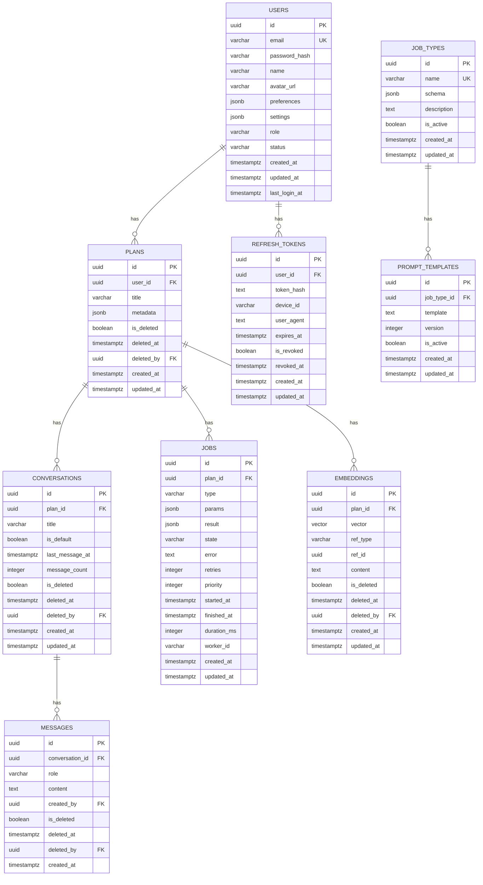

# 🗄️ WanderMind Travel Service - ERD Diagrams

## Entity Relationship Diagram (ERD)

This document contains ERD diagrams for the WanderMind Travel Service database schema.

## Complete ERD

## Entity Details

### Users Entity

**Table**: `users`

**Primary Key**: `id` (UUID)

**Unique Constraints**:

- `email` (case-insensitive)

**Relationships**:

- One-to-Many with `plans`
- One-to-Many with `refresh_tokens`

**Fields**:

- `id`: UUID primary key
- `email`: User email (unique, indexed)
- `password_hash`: Bcrypt hashed password
- `name`: User display name
- `avatar_url`: Optional avatar URL
- `preferences`: JSONB user preferences
- `settings`: JSONB user settings
- `role`: User role (USER, ADMIN)
- `status`: User status (ACTIVE, INACTIVE, BANNED)
- `created_at`: Creation timestamp
- `updated_at`: Last update timestamp
- `last_login_at`: Last login timestamp

### Plans Entity

**Table**: `plans`

**Primary Key**: `id` (UUID)

**Foreign Keys**:

- `user_id` → `users.id`
- `deleted_by` → `users.id`

**Relationships**:

- Many-to-One with `users`
- One-to-Many with `conversations`
- One-to-Many with `jobs`
- One-to-Many with `embeddings`

**Fields**:

- `id`: UUID primary key
- `user_id`: Owner user ID (indexed)
- `title`: Plan title
- `metadata`: JSONB plan metadata
- `is_deleted`: Soft delete flag
- `deleted_at`: Deletion timestamp
- `deleted_by`: User who deleted
- `created_at`: Creation timestamp
- `updated_at`: Last update timestamp

### Conversations Entity

**Table**: `conversations`

**Primary Key**: `id` (UUID)

**Foreign Keys**:

- `plan_id` → `plans.id`
- `deleted_by` → `users.id`

**Indexes**:

- Composite: `(plan_id, is_deleted, last_message_at)`
- Single: `last_message_at`

**Relationships**:

- Many-to-One with `plans`
- One-to-Many with `messages`

**Fields**:

- `id`: UUID primary key
- `plan_id`: Parent plan ID
- `title`: Optional conversation title
- `is_default`: Default conversation flag
- `last_message_at`: Last message timestamp (indexed)
- `message_count`: Total message count
- `is_deleted`: Soft delete flag
- `deleted_at`: Deletion timestamp
- `deleted_by`: User who deleted
- `created_at`: Creation timestamp
- `updated_at`: Last update timestamp

### Messages Entity

**Table**: `messages`

**Primary Key**: `id` (UUID)

**Foreign Keys**:

- `conversation_id` → `conversations.id`
- `created_by` → `users.id`
- `deleted_by` → `users.id`

**Indexes**:

- Composite: `(conversation_id, is_deleted, created_at, id)`

**Relationships**:

- Many-to-One with `conversations`

**Fields**:

- `id`: UUID primary key
- `conversation_id`: Parent conversation ID
- `role`: Message role (USER, ASSISTANT)
- `content`: Message content (text)
- `created_by`: Creator user ID
- `is_deleted`: Soft delete flag
- `deleted_at`: Deletion timestamp
- `deleted_by`: User who deleted
- `created_at`: Creation timestamp

### Jobs Entity

**Table**: `jobs`

**Primary Key**: `id` (UUID)

**Foreign Keys**:

- `plan_id` → `plans.id`

**Indexes**:

- Composite: `(plan_id, created_at)`
- Composite: `(plan_id, state)`

**Relationships**:

- Many-to-One with `plans`

**Fields**:

- `id`: UUID primary key
- `plan_id`: Parent plan ID
- `type`: Job type (e.g., "research_hotel")
- `params`: JSONB job parameters
- `result`: JSONB job result
- `state`: Job state (QUEUED, PENDING, PROCESSING, COMPLETED, FAILED, CANCELLED)
- `error`: Error message (if failed)
- `retries`: Retry count
- `priority`: Job priority
- `started_at`: Processing start timestamp
- `finished_at`: Processing end timestamp
- `duration_ms`: Processing duration (milliseconds)
- `worker_id`: Worker identifier
- `created_at`: Creation timestamp
- `updated_at`: Last update timestamp

### Job Types Entity

**Table**: `job_types`

**Primary Key**: `id` (UUID)

**Unique Constraints**:

- `name`

**Relationships**:

- One-to-Many with `prompt_templates`

**Fields**:

- `id`: UUID primary key
- `name`: Job type name (unique)
- `schema`: JSONB parameter schema
- `description`: Job type description
- `is_active`: Active flag
- `created_at`: Creation timestamp
- `updated_at`: Last update timestamp

### Prompt Templates Entity

**Table**: `prompt_templates`

**Primary Key**: `id` (UUID)

**Foreign Keys**:

- `job_type_id` → `job_types.id`

**Indexes**:

- Composite: `(job_type_id, version)`

**Relationships**:

- Many-to-One with `job_types`

**Fields**:

- `id`: UUID primary key
- `job_type_id`: Parent job type ID
- `template`: Handlebars template text
- `version`: Template version number
- `is_active`: Active flag
- `created_at`: Creation timestamp
- `updated_at`: Last update timestamp

### Embeddings Entity

**Table**: `embeddings`

**Primary Key**: `id` (UUID)

**Foreign Keys**:

- `plan_id` → `plans.id`
- `deleted_by` → `users.id`

**Indexes**:

- Composite: `(plan_id, created_at)`
- Composite: `(plan_id, ref_type)`
- Composite: `(plan_id, ref_type, ref_id)`
- Vector: HNSW index on `vector` column

**Relationships**:

- Many-to-One with `plans`

**Fields**:

- `id`: UUID primary key
- `plan_id`: Parent plan ID
- `vector`: Vector embedding (pgvector, dimension 1536)
- `ref_type`: Reference type (e.g., "message", "job")
- `ref_id`: Reference ID (UUID, nullable)
- `content`: Original content text
- `is_deleted`: Soft delete flag
- `deleted_at`: Deletion timestamp
- `deleted_by`: User who deleted
- `created_at`: Creation timestamp
- `updated_at`: Last update timestamp

### Refresh Tokens Entity

**Table**: `refresh_tokens`

**Primary Key**: `id` (UUID)

**Foreign Keys**:

- `user_id` → `users.id`

**Relationships**:

- Many-to-One with `users`

**Fields**:

- `id`: UUID primary key
- `user_id`: Owner user ID
- `token_hash`: Hashed refresh token
- `device_id`: Device identifier
- `user_agent`: User agent string
- `expires_at`: Token expiration timestamp
- `is_revoked`: Revocation flag
- `revoked_at`: Revocation timestamp
- `created_at`: Creation timestamp
- `updated_at`: Last update timestamp

## Relationship Details

### User → Plans (1:N)

- One user can have many plans
- Plan ownership enforced via `user_id` foreign key
- Cascade delete: Plans deleted when user deleted

### Plan → Conversations (1:N)

- One plan can have many conversations
- One default conversation per plan (`is_default` flag)
- Cascade delete: Conversations deleted when plan deleted

### Plan → Jobs (1:N)

- One plan can have many jobs
- Jobs track research and processing tasks
- Cascade delete: Jobs deleted when plan deleted

### Plan → Embeddings (1:N)

- One plan can have many embeddings
- Embeddings store vector representations of plan content
- Cascade delete: Embeddings deleted when plan deleted

### Conversation → Messages (1:N)

- One conversation can have many messages
- Messages can be from user or assistant
- Cascade delete: Messages deleted when conversation deleted

### Job Type → Prompt Templates (1:N)

- One job type can have many prompt templates
- Templates versioned for evolution
- Cascade delete: Templates deleted when job type deleted

### User → Refresh Tokens (1:N)

- One user can have many refresh tokens (multiple devices)
- Tokens can be revoked individually
- Cascade delete: Tokens deleted when user deleted

## Indexes

### Primary Indexes

- All tables have UUID primary keys

### Foreign Key Indexes

- `plans.user_id`
- `conversations.plan_id`
- `messages.conversation_id`
- `jobs.plan_id`
- `embeddings.plan_id`
- `refresh_tokens.user_id`

### Composite Indexes

- `conversations(plan_id, is_deleted, last_message_at)` - For listing conversations
- `messages(conversation_id, is_deleted, created_at, id)` - For listing messages
- `jobs(plan_id, created_at)` - For listing jobs
- `jobs(plan_id, state)` - For filtering jobs by state
- `embeddings(plan_id, created_at)` - For listing embeddings
- `embeddings(plan_id, ref_type)` - For filtering by reference type
- `embeddings(plan_id, ref_type, ref_id)` - For finding specific embeddings
- `prompt_templates(job_type_id, version)` - For template versioning

### Special Indexes

- `users.email` - Case-insensitive unique index
- `embeddings.vector` - HNSW vector index for similarity search

## Soft Delete Pattern

The following entities support soft delete:

- `plans` (is_deleted, deleted_at, deleted_by)
- `conversations` (is_deleted, deleted_at, deleted_by)
- `messages` (is_deleted, deleted_at, deleted_by)
- `embeddings` (is_deleted, deleted_at, deleted_by)

Soft delete fields:

- `is_deleted`: Boolean flag
- `deleted_at`: Timestamp of deletion
- `deleted_by`: User who performed deletion

## Vector Storage

The `embeddings` table uses pgvector extension:

- Column: `vector` (type: vector(1536))
- Index: HNSW index for fast similarity search
- Dimension: 1536 (OpenAI embedding dimension)
- Similarity: Cosine similarity for semantic search

## Data Types

### UUID

- Primary keys
- Foreign keys
- Reference IDs

### Timestamps

- `created_at`: Creation timestamp (timestamptz)
- `updated_at`: Last update timestamp (timestamptz)
- `deleted_at`: Deletion timestamp (timestamptz)
- `last_login_at`: Last login timestamp (timestamptz)
- `expires_at`: Expiration timestamp (timestamptz)
- `started_at`: Start timestamp (timestamptz)
- `finished_at`: End timestamp (timestamptz)

### JSONB

- `preferences`: User preferences
- `settings`: User settings
- `metadata`: Plan metadata
- `params`: Job parameters
- `result`: Job results
- `schema`: Job type schema

### Vector

- `vector`: Embedding vector (pgvector)

## Constraints

### Unique Constraints

- `users.email` (case-insensitive)
- `job_types.name`

### Foreign Key Constraints

- All foreign keys have CASCADE delete
- Referential integrity enforced

### Check Constraints

- `users.role` in (USER, ADMIN)
- `users.status` in (ACTIVE, INACTIVE, BANNED)
- `messages.role` in (USER, ASSISTANT)
- `jobs.state` in (QUEUED, PENDING, PROCESSING, COMPLETED, FAILED, CANCELLED)
