# 🔄 WanderMind Travel Service - Sequence Diagrams

## Sequence Diagrams

This document contains sequence diagrams for key interactions in the WanderMind Travel Service.

## 1. User Registration Sequence

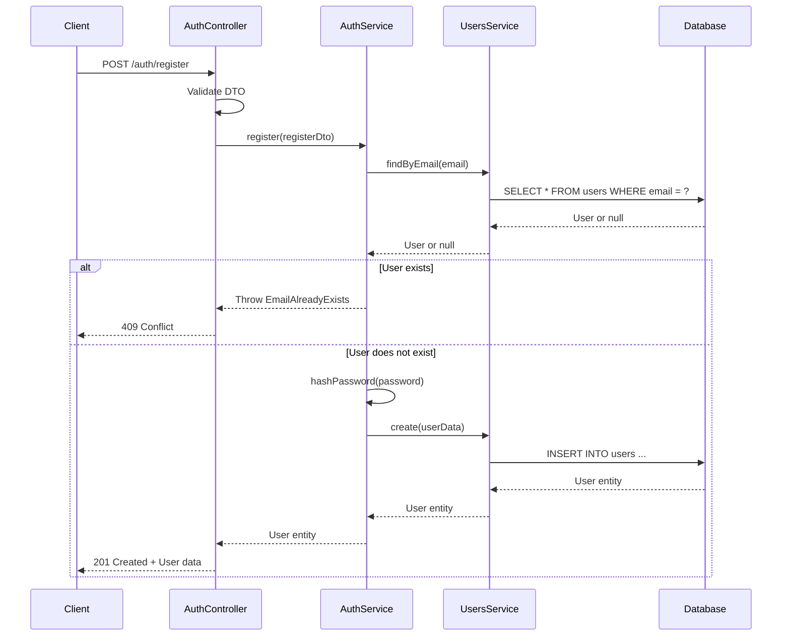

## 2. User Login Sequence

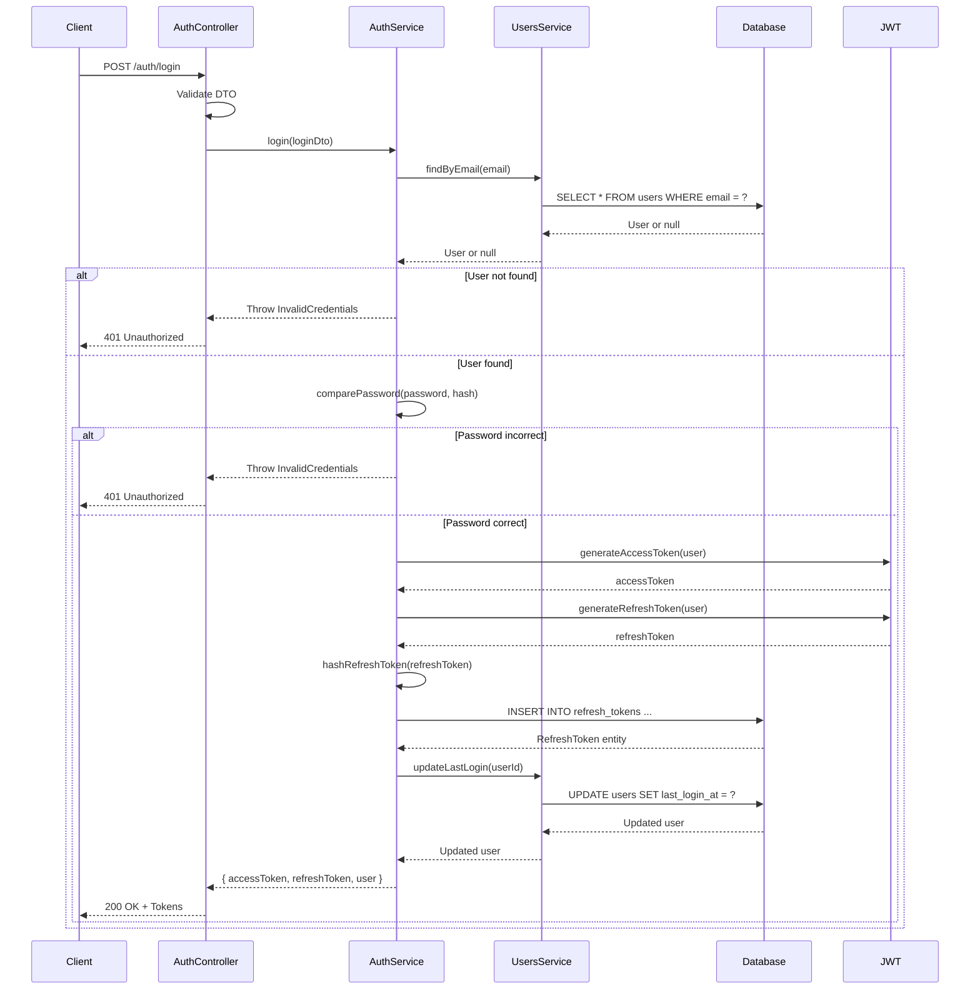

## 3. Create Plan Sequence

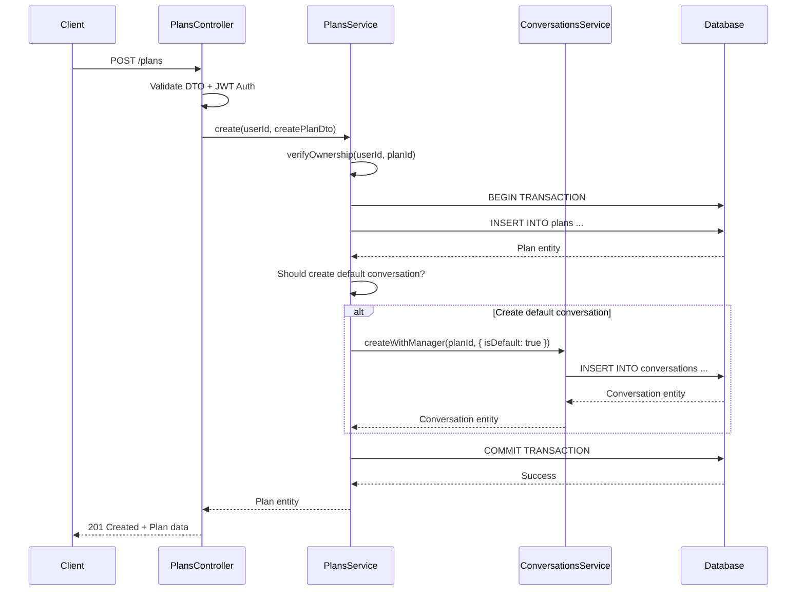

## 4. Create and Process Job Sequence

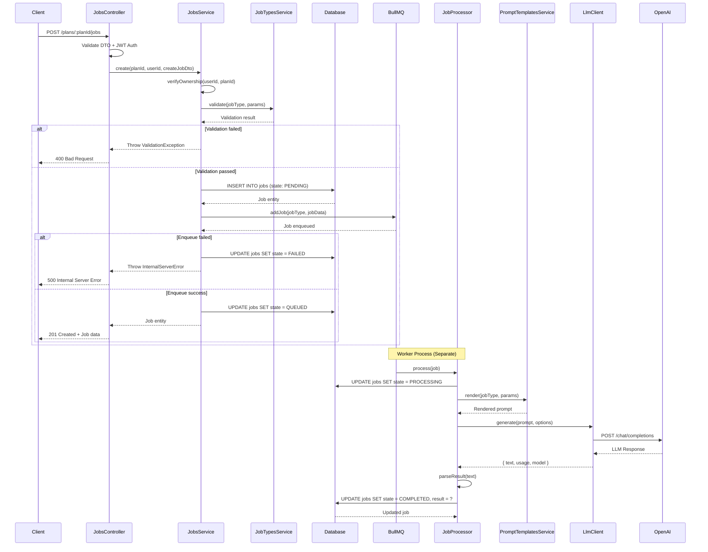

## 5. Chat Message Sequence

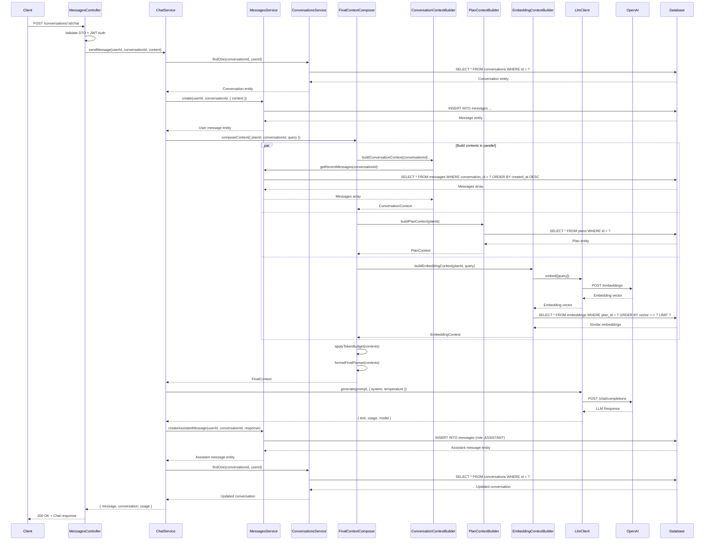

## 6. Create Embedding Sequence

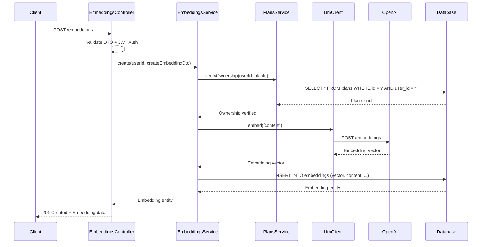

## 7. Semantic Search Sequence

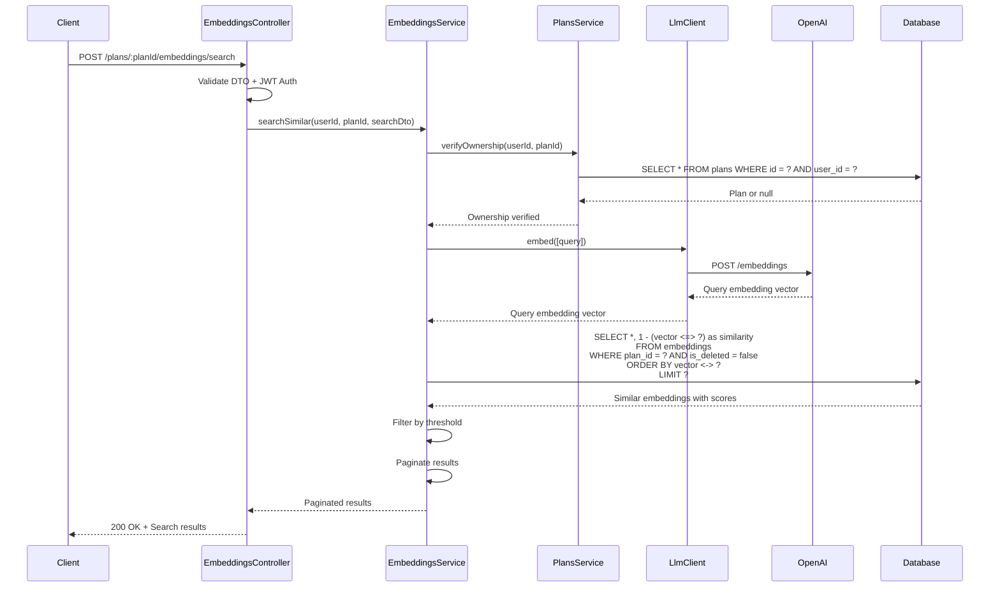

## 8. Token Refresh Sequence

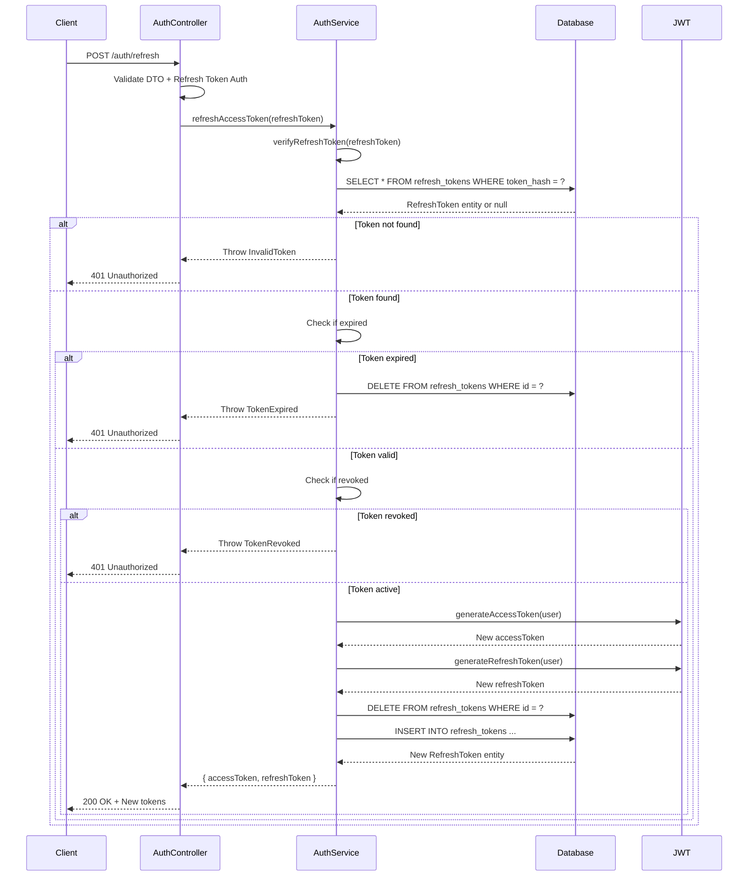

## 9. Memory Compression Sequence

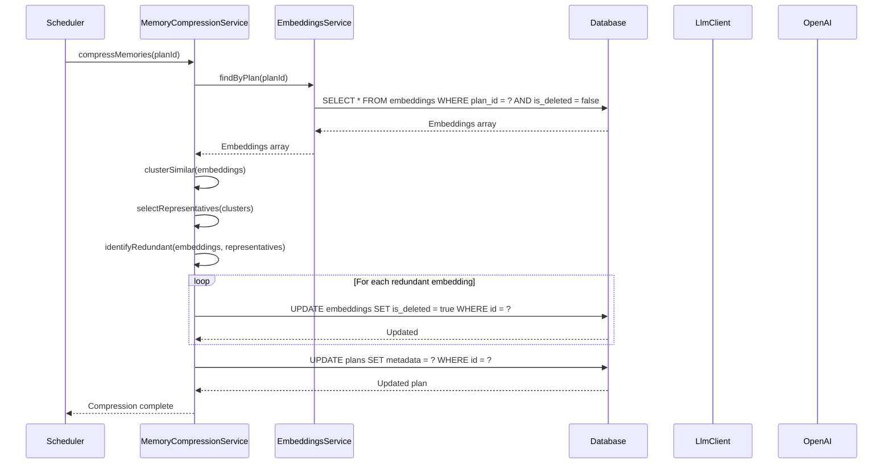

## 10. Context Building Sequence (Detailed)

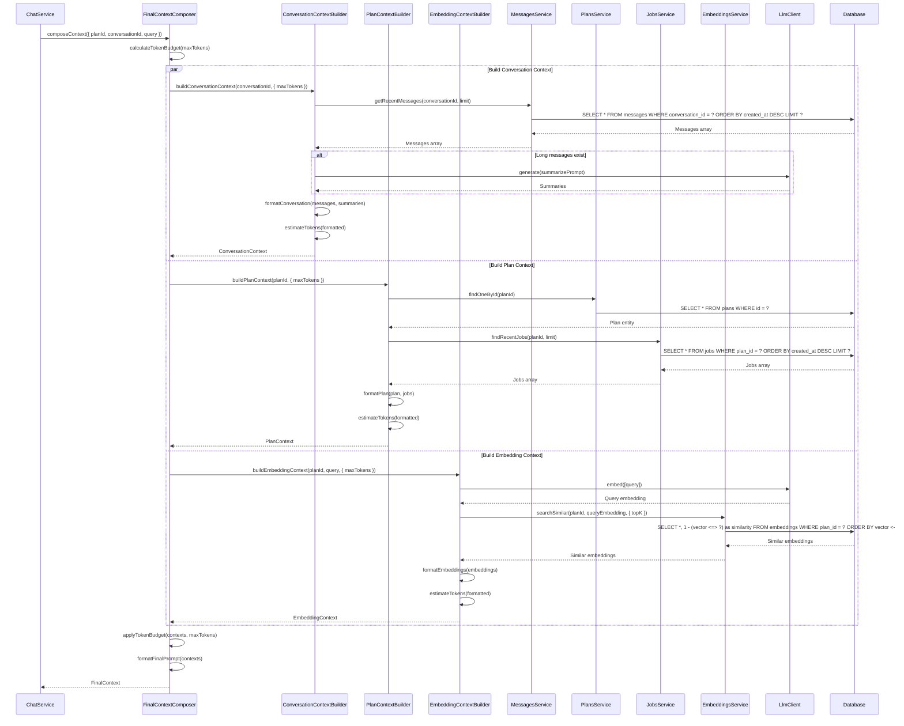

## 11. Error Handling Sequence

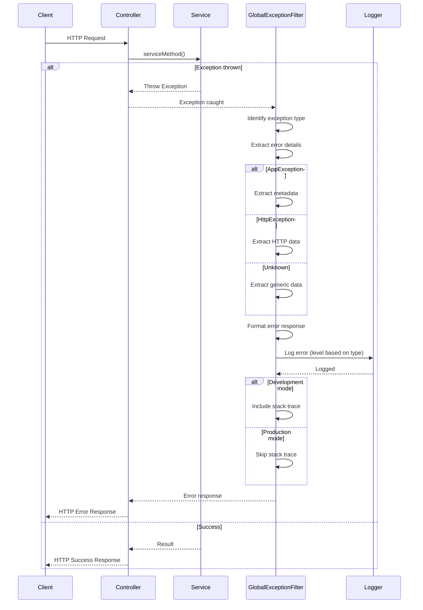

## 12. Rate Limiting Sequence

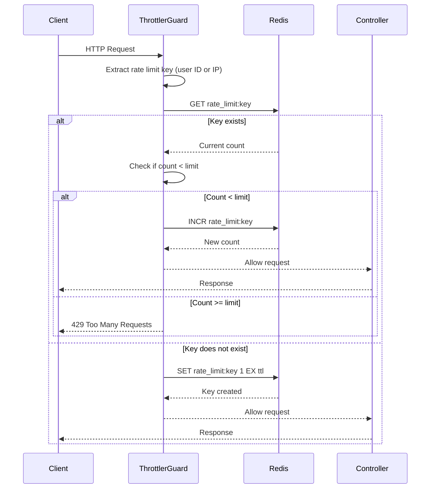

## Interaction Patterns

### Synchronous Interactions

- Most API endpoints are synchronous
- Immediate response to client
- Database operations are blocking

### Asynchronous Interactions

- Job processing via BullMQ
- Worker process handles jobs separately
- Client receives job ID immediately

### Parallel Processing

- Context building (conversation, plan, embedding)
- Multiple database queries in parallel
- Improved performance

### Error Propagation

- Exceptions bubble up through layers
- Global exception filter catches all
- Consistent error response format

### Transaction Management

- Database transactions for multi-step operations
- Rollback on failure
- Consistency guarantees
